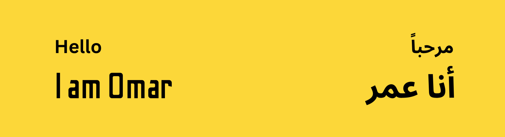

# Omar Ghassan Abu Deyak

## About Me
I am Omar Ghassan Abu Deyak, a Software Engineer specialized in Full Stack Web Development. Currently, I am a Full Stack Developer trainee at Orange Coding Academy. I specialize in **React** for Front-End development, **PHP** and **Laravel** for Back-End development, and **Web APIs**.

During my work experience, I have participated in multiple internships and bootcamps, receiving training in various fields. My latest training was as a Full Stack Web Developer at Orange Coding Academy. This intensive bootcamp covered many topics, from the basics of HTML and CSS to advanced topics in React for the Front-End. On the Back-End side, topics such as JavaScript, PHP, Laravel, and MySQL were covered, emphasizing best practices in these technologies. I have built many Full Stack projects from scratch.

## My Skills
<table>
  <tr>
    <td> HTML</td>
    <td> CSS</td>
    <td> JavaScript</td>
    <td> React</td>
  </tr>
  <tr>
    <td> PHP</td>
    <td> Laravel</td>
    <td> Web APIs</td>
  </tr>
</table>

## Connect with Me

